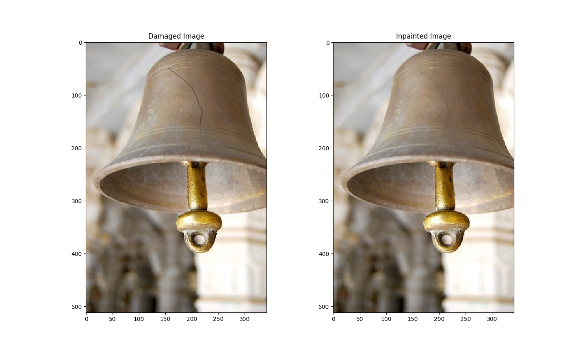

# Bilateral Image Inpainting
> This project implements a new inpainting method that proposes convolution with a bilateral averaging kernel. Traditional  convolution-based inpainting use image information from only a space neighborhood. A more robust approach (in structure and texture preserving) of convolution–based inpainting is using information from both space and range. This implementation produces some fascinating results when it comes to structural and textural restoration of damaged regions of the image.

## Steps to follow:
- ### 1. Change path in the following files:
  - config/settings.config
    ```shell
    "master_working_directory": "/Users/mymac/Desktop/Assignments/DIP-Assignments/Project/test/Bilateral_Image_Inpainting/code/"
    "log_directory": "/Users/mymac/Desktop/Assignments/DIP-Assignments/Project/test/Bilateral_Image_Inpainting/code/config"
    
    to 
    
    "master_working_directory": "Your_Directory/Bilateral_Image_Inpainting/code/"
    "log_directory": "Your_Directory/Bilateral_Image_Inpainting/code/config"
    ```
  - GUI/mousecallback.py
    ```shell
    master_working_path = "/Users/mymac/Desktop/Assignments/DIP-Assignments/Project/test/Bilateral_Image_Inpainting/code/"
    
    to 
    
    master_working_path = "Your_Directory/Bilateral_Image_Inpainting/code/"
    ```

## Install the required python modules used in the project (execute inside /Bilateral_Image_Inpainting):
```shell
$ pip3 install -r requirements.txt
```

## Compile using the following command (execute inside /Bilateral_Image_Inpainting):
```shell
$ python -m compileall .
```

## Result:

